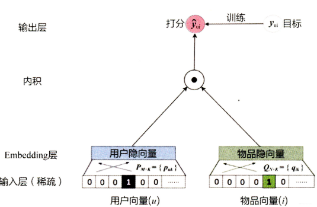
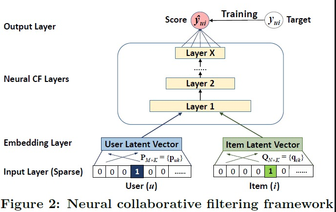
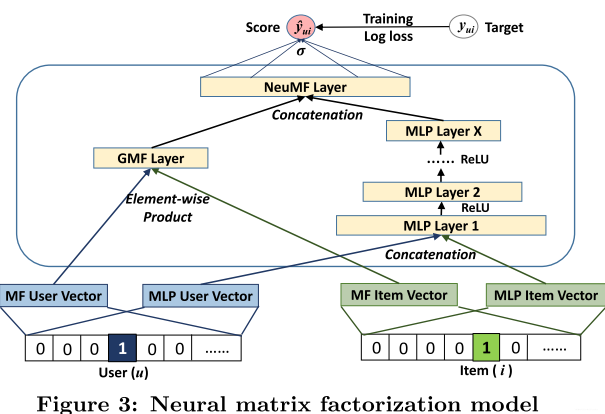

# 一些基础数据

数据自2023.5月份，有人购买过的商品总数为198176。购买过商品的人总数为1004582。
购买过商品的人和商品的笛卡尔积为387万。

## 目录说明

## model.py

`model.py`说明：

- 里面包含了三个模型实现：GMF、MLP、以及基于GMF+MLP的NeuralMF
- GMF(广义矩阵分解)模型的实现
- Embedding的维度是32。相当于每个商品和每个用户，都是一个长度32的向量表示。如果维度为1，那么就等同于传统的矩阵分解。
- 虽然是NeuralNet，但是GMF本质还是CF（协同过滤）。无法推荐没有购买记录的商品
- MLP是最常见的多层感知机
- GMF和MLP训练和推理的时候，对显存要求都不高。NeuralMF需要至少8G，而且由于模型复杂，需要训练的次数也较多，才能将损失值降低到稳定状态。

模型图：

## data目录

data目录为用于训练的数据。

`data_user_item.csv`为用户和商品的数据。

1. 第一列：memberId 用户id
2. 第二列：productCode 商品编码
3. 第三列：thirdCategoryId 品类
4. 第四列：buyCount 购买次数

`data_user_category.csv`为用户和品类的数据。

1. 第一列：memberId 用户id
2. 第二列：thirdCategoryId 品类
3. 第三列：buyCount 购买次数

## 数据预处理

`user_item_data_process.py`说明：

- 用户item数据处理，会将数据转化为n*3的张量。并且保存到文件`Pre_data`中。
- 会将每个用户id、每个memberid，转换为从0开始的int。也就是idx。n=x，x就是第x个用户。用户和商品的idx字典，也会保存在`Pre_data`。在本数据集中，n=387万
- n*3中，第一列为用户idx，第二列为物品的idx，第三列为购买评分
- 购买评分根据公式`torch.sigmoid((values-1)/2)`计算得到（模型要求值必须在0-1之间，而购买数量一般都是大于等于1的整数）。如果购买记录为1，那么公式值为0.5。除以2是为了降低sigmoid函数的陡峭，让其更平滑。
- 所以，推理的时候，会要求计算得到的评分值，大于0.5，否则不推荐。

## 训练

`user_item_train.py`说明：

- 会读取预处理保存的向量
- 支持GPU：nvdia cuda、apple mps
- 训练过程就是pytorch标准的流程
- 训练结束之后，把会模型保存到`Pre_train`中
- nvidia训练大概需要3-5分钟，损失值能降低到最低

## 推理

`user_item_mode_reasoning.py`说明：

- 读取`Pre_train`的模型，用于推理。推理可以有两个模式：
  - 给定用户和一个商品，计算推荐值
  - 给定用户，计算其对所有的商品的推荐值，然后过滤大于0.5的，然后倒排。这个模式一般会用到生产推荐。
- 推理的时候，要将memberId，转化为用户idx。然后计算

## 三个模型对比

| 模型     | 训练  | 稳定损失值 | 显存  | 可解释性                |
| -------- | ----- | ---------- | ----- | ----------------------- |
| GMF      | 5000  | 0.67374    | 1.5GB | 较强                    |
| MLP      | 6000  | 0.67420    | 1.5GB | MLP难以解释             |
| NeuralMF | 10000 | 0.67369    | 8GB   | 因为叠加了MLP，难以解释 |

综合来讲，使用NeuralMF的收益并不高。由于它本质也属于CF，依然存在协同过滤的很多缺点。我们最后还是选择GMF
